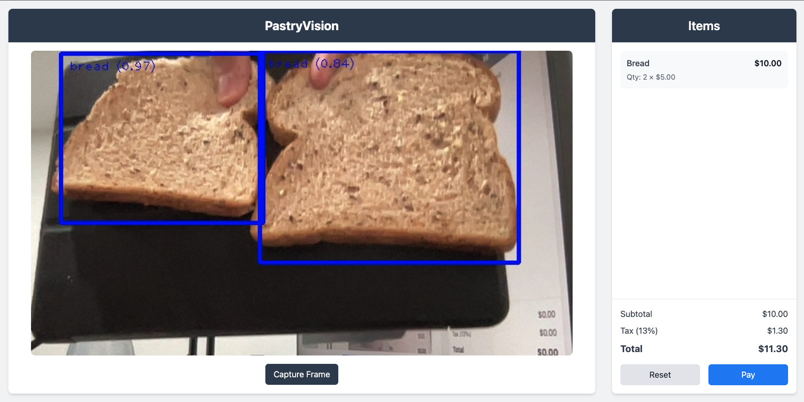

# PastryVision

**PastryVision** is a computer vision project designed to help small pastry shops modernize their operations. By automatically detecting and tallying items in a customer's cart, the system enables a self-serve workflow that enhances efficiency while reducing costs. It eliminates the need for plastic packaging and barcode printing, promotes pastry freshness, and operates locally without requiring web hosting. With its simple and user-friendly setup, PastryVision empowers pastry shops to deliver a modern customer experience effortlessly.

## Running the Project

1. [Start/Stop the frontend client](https://github.com/peterdanwan/PastryVision/tree/main/frontend/README.md)
2. [Start/Stop the backend server](https://github.com/peterdanwan/PastryVision/tree/main/backend/README.md)

## PastryVision Workflow

1. The frontend camera scans the pastry items on customer's tray.
2. The customer takes a snapshot of their tray.
3. The snapshot is sent to the backend to detect and identify the pastry items on the tray.
4. The backend automatically tallies the quantities and costs of the tray and sends this information to the frontend.
5. The customer can confirm the cost breakdown provided from the backend and proceed to pay or cancel their transaction.

## Tech Stack

- [React](https://react.dev)
- [Vite](https://vitejs.dev)
- [JavaScript](https://developer.mozilla.org/en-US/docs/Web/JavaScript)
- [TailwindCSS](https://tailwindcss.com)
- [shadcn/ui](https://ui.shadcn.com)
- [FastAPI](https://fastapi.tiangolo.com)
- [Python](https://www.python.org)
- [OpenCV](https://opencv.org)
- [Google MediaPipe](https://developers.google.com/mediapipe)
- [TensorFlow](https://www.tensorflow.org/)
- [NumPy](https://numpy.org/)

## References

1. [MediaPipe](https://ai.google.dev/edge/mediapipe/solutions/studio)
2. [React & ML Object Detection Example](https://eliraneln.medium.com/real-time-object-detection-using-ml5-js-and-react-c47612c60852)
3. [Vite Configuration Guide](https://vite.dev/guide/)
4. [TailwindCSS Documentation](https://tailwindcss.com/docs/guides/vite)
5. [MediaPipe Object Detection Example](https://colab.research.google.com/github/googlesamples/mediapipe/blob/main/examples/object_detection/python/object_detector.ipynb#scrollTo=huDfvvkvkqzC)
6. [Training your own model using mediapipe](https://ai.google.dev/edge/mediapipe/solutions/customization/object_detector)
7. [Bread dataset on roboflow](https://universe.roboflow.com/licenta-ntbhr/brv2/dataset/5)
8. [FastAPI - to build our backend](https://fastapi.tiangolo.com/)
9. [OpenCV - computer vision operations library](https://opencv.org/)
10. [Python multipart parser](https://github.com/Kludex/python-multipart)
11. [Mediapipe Examples GitHub Repo](https://github.com/google-ai-edge/mediapipe-samples)
12. [BB Brain (example solution in Japan)](https://www.corp.bb-brain.co.jp/en.html)
13. [Viscovery](https://viscovery.com/en/technology/)

## Authors

- [Aryan Khurana](github.com/AryanK1511)
- [Peter Wan](#pastryvision)
- [Mimi Dang](#pastryvision)
- [Jeremy Lee](#pastryvision)
